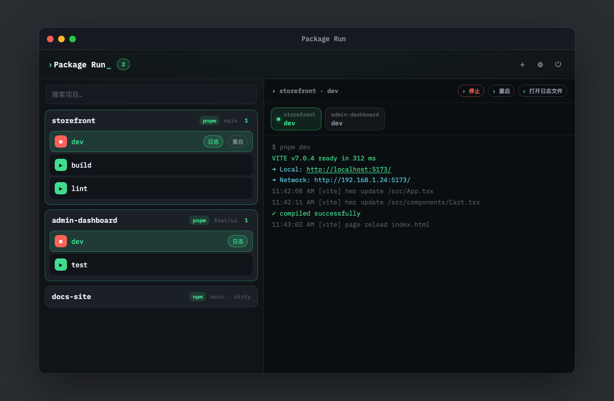
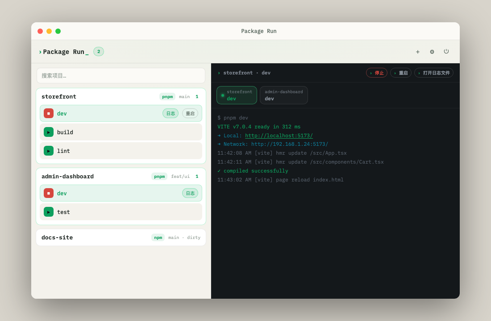
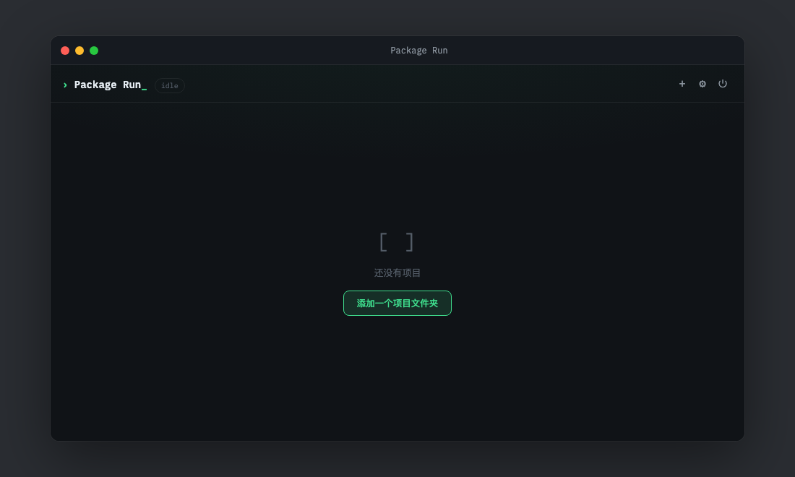

# Package Run

[English](./README.md) · [中文](./README.zh.md)

**关键词：** 前端项目管理 · 本地 dev server · 菜单栏应用 · 系统托盘 · Tauri · React · pnpm/npm/yarn/bun · JS 版 Laravel Herd

**Package Run** 是轻量级**本地前端项目管理工具**，基于 **Tauri 2** 构建。  
macOS 上常驻菜单栏（类似 [Laravel Herd](https://herd.laravel.com/)）；Windows / Linux 为常规窗口 + 系统托盘。

一键管理多个前端项目的 dev server：**启动 / 停止 / 重启** `package.json` 脚本、看日志、跳转 `localhost`、在编辑器/终端中打开——不用在多个终端标签里来回切。

| | |
| --- | --- |
| **仓库** | https://github.com/xl495/package-run |
| **下载 / Releases** | https://github.com/xl495/package-run/releases |
| **当前版本** | [v0.2.0](https://github.com/xl495/package-run/releases/tag/v0.2.0) |
| **技术栈** | Tauri 2 · React 19 · TypeScript · Vite · Rust |

## 截图

<p align="center">
  
</p>

<p align="center">
  
</p>

| 深色 | 浅色 | 空状态 |
| :---: | :---: | :---: |
|  |  |  |

- **左侧：** 项目列表、包管理器、Git 分支、脚本启停  
- **右侧：** 实时运行日志 + 可快捷启停的 tabs（无任务时自动隐藏）  
- **主题：** 深色 / 浅色 / 跟随系统  

## 功能

| 能力 | 说明 |
| --- | --- |
| 菜单栏 / 托盘 | 左键/右键托盘图标弹出**原生菜单**（类似 Herd）：打开、添加项目、设置、更新、退出；双击打开主窗口 |
| 主窗口 | 可缩放的管理窗口（不再是小弹层），用于项目、脚本、日志与设置 |
| 左右分栏 | 左项目、右日志；无运行日志时隐藏右侧栏 |
| 项目管理 | 添加含 `package.json` 的本地目录；搜索、置顶、拖拽排序 |
| 包管理器 | 自动识别 pnpm / yarn / bun / npm（lockfile + `packageManager` 字段），可手动覆盖 |
| Git 状态 | 显示当前分支与未提交改动标记 |
| 脚本控制 | 一键启动 / 停止 / 重启任意 script；停止时杀掉整棵进程树，不留僵尸进程 |
| 日志 tabs | 运行中 / 历史脚本以 tab 展示，可快捷 ▶ / ⏹ |
| 实时日志 | 面板保留最近约 500 行；完整日志落盘到 `logs/`；日志中的 URL 可点击打开 |
| 本地预览 | 自动识别输出中的 `localhost` 地址，一键浏览器打开 |
| 端口工具 | 端口占用检测与一键释放；日志出现 `EADDRINUSE` 时自动定位占用进程 |
| 快捷打开 | 在 Cursor / VS Code / Zed / WebStorm、iTerm / Warp / Terminal、Finder 中打开项目 |
| 启动配置 | 为每个脚本配置端口、环境变量、env 文件、附加参数 |
| 自启 | 应用开机自启；可为单个脚本设置登录后自动运行 |
| 更新提醒 | 启动时检查 GitHub Releases；顶部横幅 + 设置里可手动检查 |
| 外观 | 中英切换、浅色 / 深色 / 跟随系统 |

## 技术栈

- **Tauri 2**（Rust：进程管理、日志流、托盘、快捷键）
- **React 19 + TypeScript + Vite 7**
- 插件：`positioner` · `dialog` · `autostart` · `global-shortcut` · `opener`

## 开发

环境要求：

- Node.js 20+
- [pnpm](https://pnpm.io/) 9+
- [Rust](https://www.rust-lang.org/) 稳定版
- 系统依赖见 [Tauri 前置条件](https://v2.tauri.app/start/prerequisites/)

```bash
pnpm install
pnpm tauri dev
```

## 本地打包

```bash
pnpm tauri build
```

产物目录：`src-tauri/target/release/bundle/`

| 平台 | 常见产物 |
| --- | --- |
| macOS | `macos/Package Run.app`、`dmg/Package Run_*.dmg` |
| Windows | `msi/`、`nsis/` |
| Linux | `deb/`、`appimage/` |

## GitHub 自动打包

本仓库已配置 GitHub Actions（`tauri-apps/tauri-action`），可在 **macOS（Apple Silicon + Intel）、Windows、Linux** 上自动构建并上传到 Release。

### 触发方式

1. **打 tag 发布（推荐）**

   ```bash
   # 先把 package.json / tauri.conf.json / Cargo.toml 版本号改成一致，例如 0.2.0
   git tag v0.2.0
   git push origin v0.2.0
   ```

2. **手动运行**：GitHub → Actions → **Release** → Run workflow

3. **推送到 `release` 分支**也会触发

构建完成后会创建 **Draft Release**，产物挂在 Assets 下。确认无误后在 GitHub 上点 Publish。

### 仓库权限

若 Action 报 `Resource not accessible by integration`：

仓库 **Settings → Actions → General → Workflow permissions** 勾选 **Read and write permissions**。

### 关于 macOS 签名

当前 CI **未配置** Apple 开发者证书。未签名的 Apple Silicon 安装包，系统可能提示「已损坏」。用户可执行：

```bash
xattr -cr "/Applications/Package Run.app"
```

正式分发请按 [Tauri macOS 签名文档](https://v2.tauri.app/distribute/sign/macos/) 配置证书与 Secrets。

## 数据存储

| 平台 | 路径 |
| --- | --- |
| macOS | `~/Library/Application Support/com.huangxinliang.packagerun/` |
| Windows | `%APPDATA%\com.huangxinliang.packagerun\` |
| Linux | `~/.local/share/com.huangxinliang.packagerun/` |

主要文件：`projects.json`（项目列表与配置）、`settings.json`（快捷键等）。

## License

[MIT](./LICENSE)
